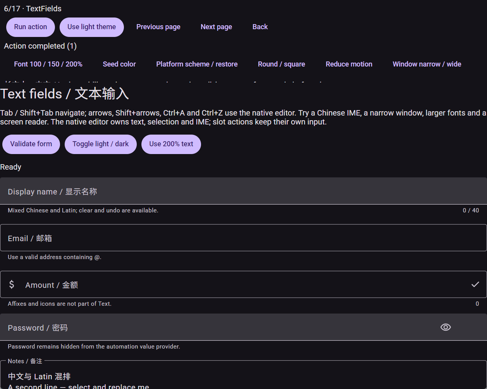
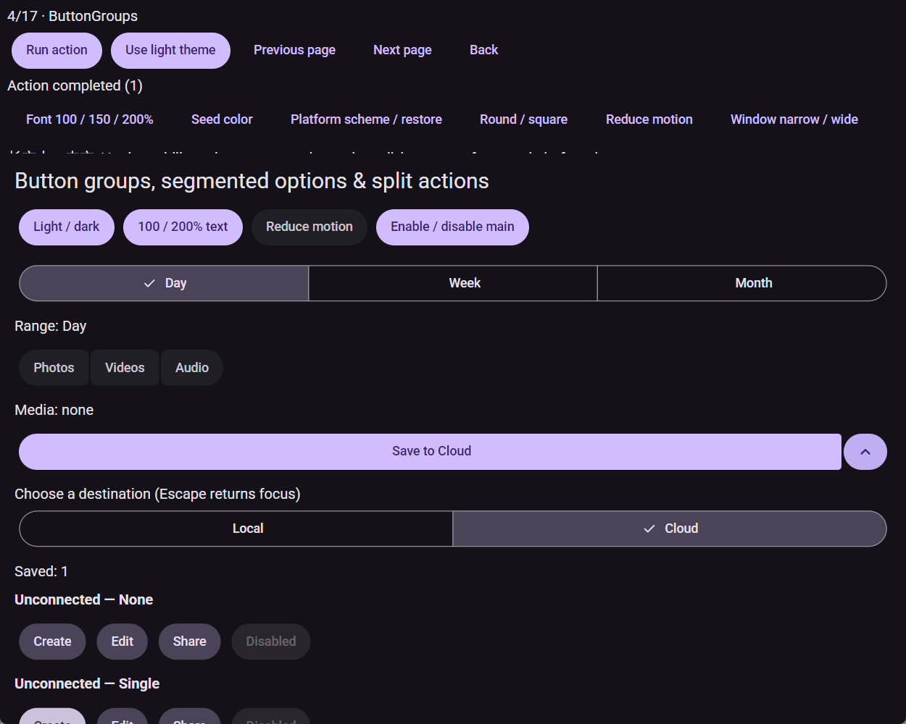
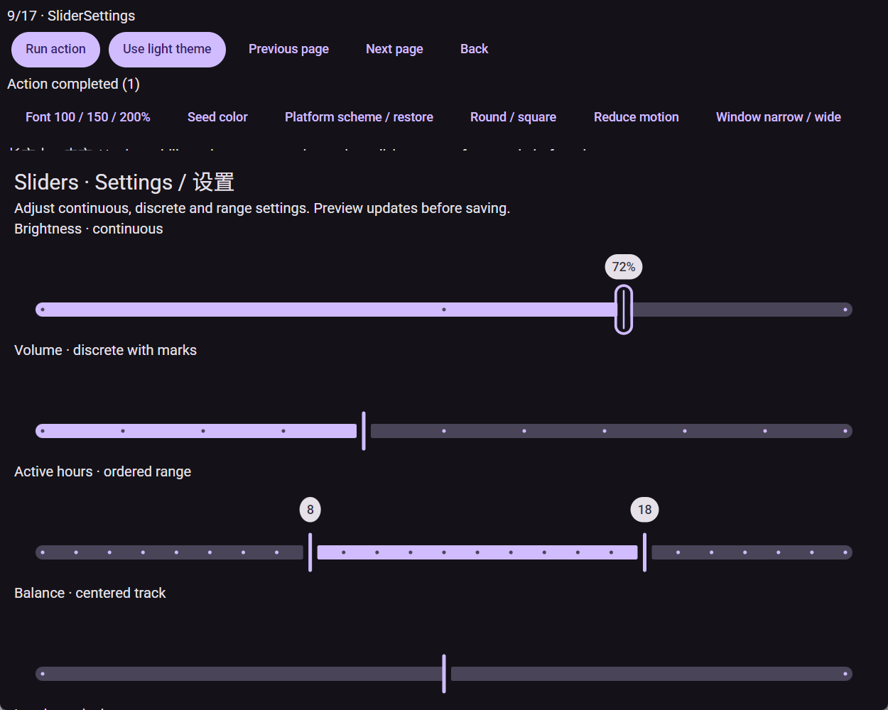
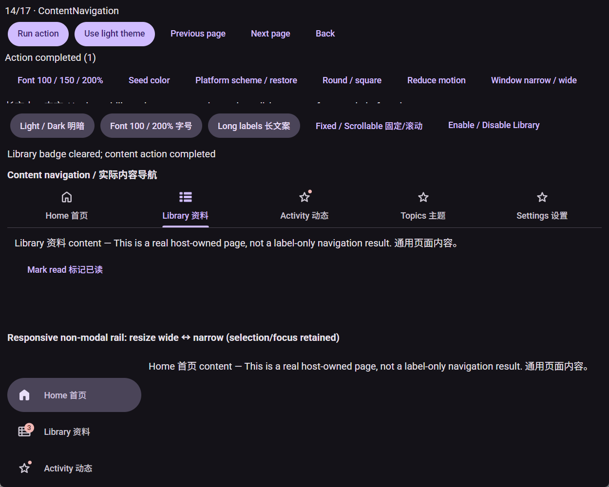
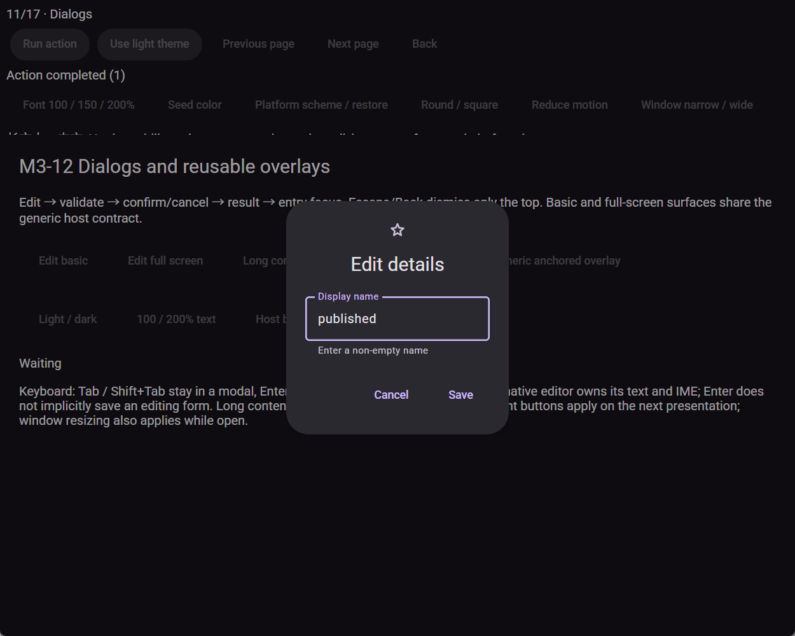
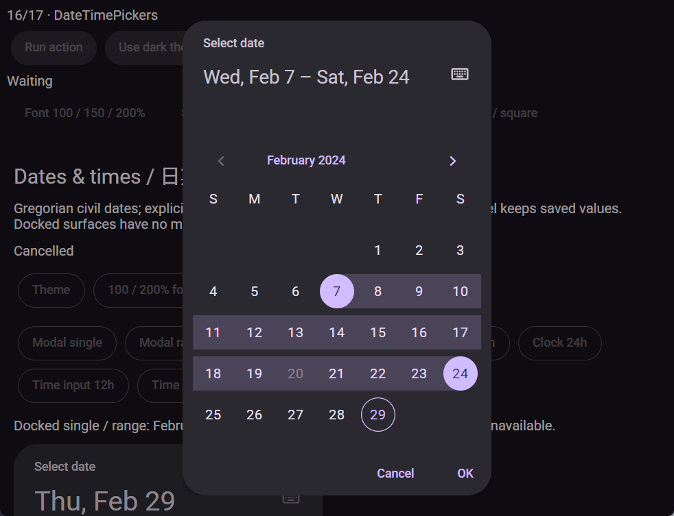
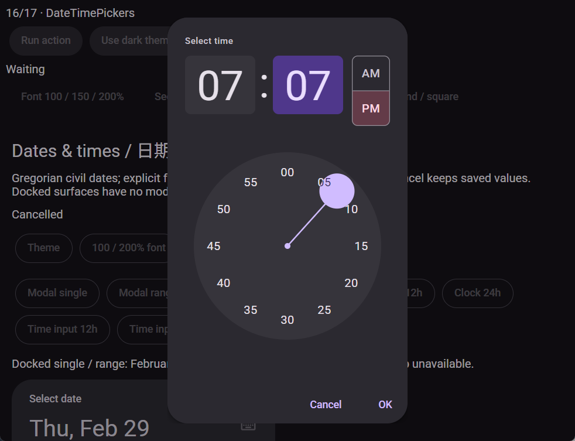
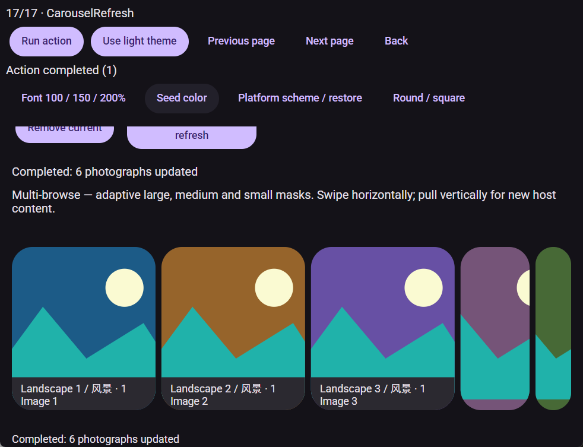

# preview.3 人工反馈修复与复验候选

2026-10-07。集成分支 `integration/m3-spec-1`，产物源码 `88c1c20b791947535c373a84f3920c5d9d72d616`。

这轮针对用户的十张截图修复了图标、子像素布局、状态尺寸、动画和规范几何，并交付可运行的 Windows x64 展厅。母规格 #1 的人工视觉与交互复验继续使用这一候选。

## 运行与产物

- [NativeAOT 展厅](../../artifacts/p-b3ca5053/aot/Gallery/Gallery.exe)
- [NativeAOT 独立宿主](../../artifacts/p-b3ca5053/aot/StandaloneHost/StandaloneHost.exe)
- [版本化控件包](../../artifacts/r-a41d4376/packages/Avalonia.Material3.0.1.0-preview.3.nupkg)
- [源码／独立包 manifest](../../artifacts/r-a41d4376/manifest.json)、[四宿主发布清单](../../artifacts/p-b3ca5053/published.json)、[旧客户端兼容记录](../../artifacts/r-a41d4376/compatibility/compatibility.json)

包 SHA256：`33FBF49DAA486D3D0732FDC2E3456CC7B7FB13C3AA65B0B4BA3F42EDDFC85ACE`。

Gallery NativeAOT EXE SHA256：`344699CF7BD2B7ADA34E44FFD66A39CDCFACBF50705DF183A0099BBE2954AB2F`。

SDK 10.0.112，net10.0，Avalonia 12.1.3。产物由全新独立包消费者构建。

## 修复结果

| 范围 | 交付行为 |
| --- | --- |
| 图标与字阶 | 官方 Material Symbols Rounded 及真实 FILL 变体；固定图标框；Gallery 采用明确的 Roboto／Noto Sans SC 字体资产与许可 |
| 像素舍入 | 按钮组、FAB、菜单、工具栏及动画布局链采用局部子像素布局；文字、图标和静态描边保留各自的绘制策略 |
| FAB／按钮组 | 固定展开锚点、连续间距、独立有限内角、图标中心和尺寸过渡；复用每帧布局缓冲 |
| Switch | 原生滑动、thumb 尺寸与颜色过渡；图标与 thumb 同心；实时减少动效与拖动状态同步 |
| 文本框 | 固定编辑区域与描边包络；浮动标签过渡；透明 outline notch；前后图标与 affix 对齐；首次排列使用本帧高度 |
| Slider | 轨道、刻度、停止点、thumb 和输入映射共享轴域；标签跟随对应 handle |
| Progress | 共用框架帧回调、连续 phase、缓存与绘制路径优化；隐藏祖先停止动画工作 |
| Sheet | 有限尺寸的横／竖向 handle、状态与焦点轮廓；有界测量与自然高度缓存 |
| Navigation | 独立徽标锚点与边界约束；选中胶囊／下划线具有过渡，item 布局保持稳定 |
| 日期与时间 | 范围端点半格衔接、圆形端点、放大月份换行；固定数字／冒号／AM-PM 配方；07 分保留 42°，局部数字对比度正确 |
| Carousel | 复用内容和布局计划；中间 mask 过渡；目标宽度变化与完成缩小时更新真实模板测量；停放内容同步最终尺寸 |
| 生命周期与证据 | 时间盘解除原订阅并释放旧数字控件；原生截图等待已提交页面、兼容模态树、恢复标题视口并记录像素签名 |

文本框首次绘制的独立回归观察到 Filled 标签 −12 DIP、Outlined 标签 −8 DIP；修复后分别为 16／24 DIP，200% 字阶均为 32 DIP。四个初始位置案例覆盖第一次显示，焦点／编辑行为继续由完整场景验证。

## 验证

**782 源码／806 独立包场景通过。** 完整保留此前 774 个场景身份，并新增四个审查回归与四个初始标签案例；包消费者保留 24 个专有场景。公开 API／资源清单、不可变 preview.1 SDK 严格基线、旧编译客户端只替换控件 DLL、重新编译的 XAML／客户端均通过。

Gallery／StandaloneHost × NativeAOT／完整裁剪 managed 四个宿主均完成真实窗口验证：17 页交互、17 页 200% 字阶与窄窗口截图、模态／菜单／导航／输入／刷新，以及每宿主 5 次新进程启动。NativeAOT 与裁剪分析按 IL 警告为错误执行。发布清单的 `nativeSmoke` 为 true。

原生设备 DPI 为 120，即 RenderScaling 1.25。按钮组相同输入的 100 个样本中，显式旧舍入策略的中心为 247.6–248.4 DIP；候选默认策略为固定 247.14296875 DIP，摆动从 0.8 DIP 收敛为 0。

### Standards

两个 P2 审查问题已修复：Carousel 真实模板测量和钟面旧对象释放。精确修复、实际换行、六个模板最终尺寸、240 个旧 mark 回收与完整回归对应，复核保留 0 项开放 Standards 问题。

### Spec

三个审查问题已修复：动画布局舍入、Carousel 测量、原生页面绘制同步。随后实际截图补修首次标签布局，四宿主完成复验。原始反馈和新候选的人工检查继续记录在母规格 #1。

## 原生动画指标

同一最终包的 NativeAOT 诊断宿主，在真实 125% DPI 窗口中运行约 6.3 秒，记录 Avalonia compositor 绘制耗时。截图位于计量区间之外。

| 场景 | 绘制次数 | P95 ms | 最大 ms |
| --- | ---: | ---: | ---: |
| 标准线性 progress | 630 | 0.35 | 0.71 |
| Expressive 线性 progress | 631 | 0.66 | 0.90 |
| 完整 12 类 progress 页面 | 631 | 1.47 | 2.12 |
| FAB／菜单／工具栏／extended FAB | 579 | 2.24 | 21.16 |
| 按钮组 | 576 | 0.40 | 1.00 |
| Carousel 布局切换 | 396 | 1.16 | 40.21 |
| Carousel 位置切换 | 178 | 1.29 | 2.05 |
| Sheet | 466 | 0.80 | 12.58 |

八个场景的祖先隐藏阶段均记录 0 次绘制。指标描述本机非激活窗口的框架绘制工作；显示器呈现帧、刷新率／延迟、物理触摸与人工读屏由相应平台复验记录。最大耗时、进程 CPU 和分配保存在原始计量中，人工流畅性评价结合新展厅继续进行。

完整原始证据位于 `F:/PixivYou/analysis/m3-manual-quality/evidence/integrated-88c1c20/`，包括 `motion-summary.json`、各场景 `metrics.json`／`hidden.json`、`rounding-measured/metrics.json` 与 `focused-pickers/observations.json`。历史工作树产物已迁移至 `preserved-worktree-artifacts/`，对应原路径／提交保存在 `relocations.json`；实施源码保留于 Git 提交。

## 截图

